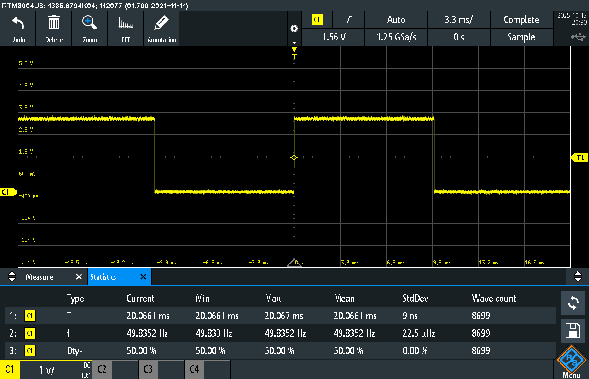
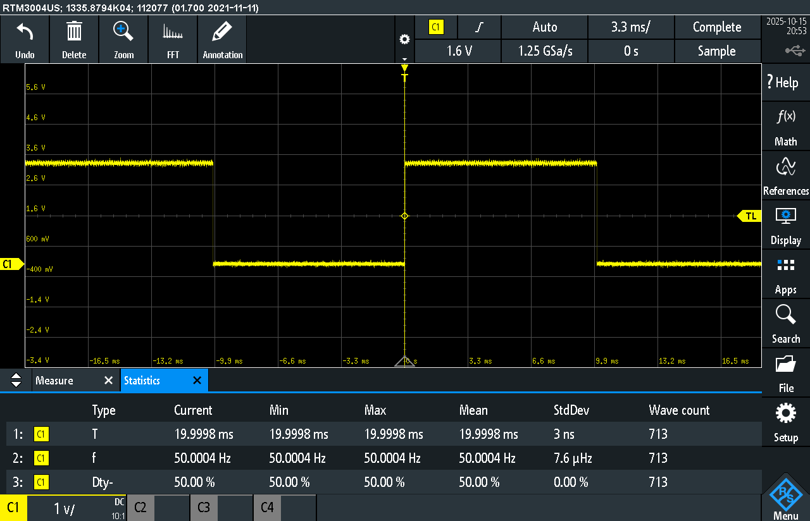
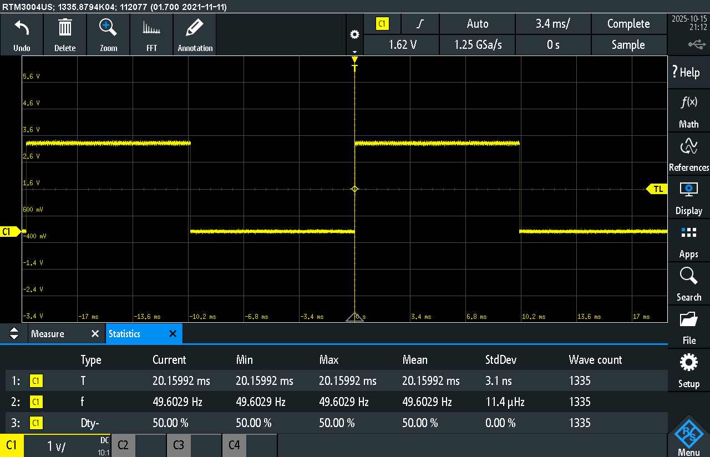
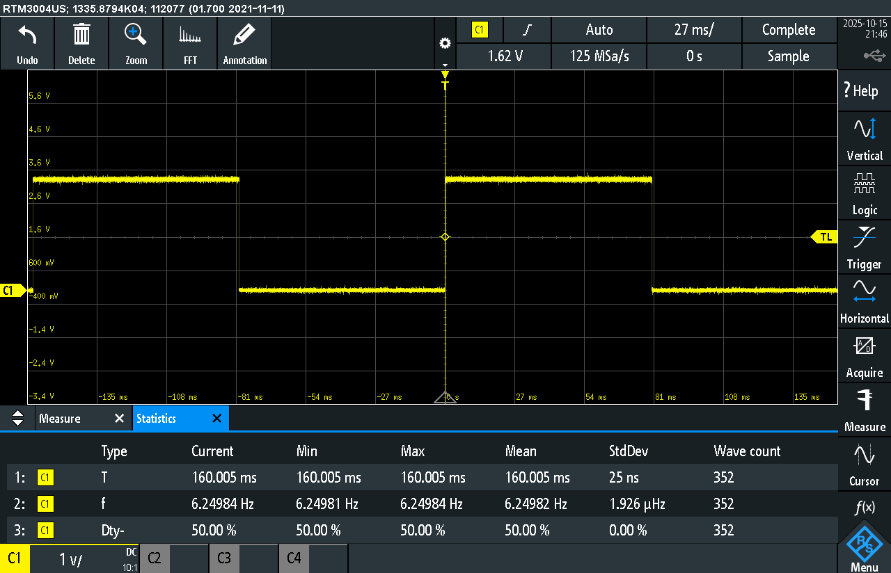
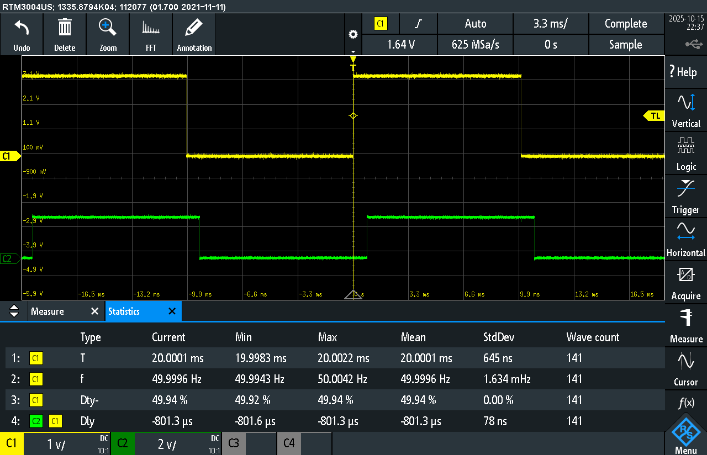

# Lawrence & Burke Lab 5

This lab measures the accuracy, drift, jitter, and latency of different timekeeping methods in a FreeRTOS environment on the Raspberry Pi Pico, as well as the latency of a GPIO interrupt response.

---

## Objective
- Compare the precision of sleep, task_delay, and timer-based delays.
- Quantify drift over one hour and jitter using the oscilloscope’s statistical measurements.- Observe how busy-wait loops affect real-time behavior.
- Measure GPIO interrupt latency using the oscilloscope.

---

## Results

### 1. Without Busy-Wait Delay

| Method       | Drift (over 1 hour) | Direction | Jitter |
|---------------|---------------------|------------|---------|
| Sleep         | 0.33% | Slower | 9 ns |
| Task_Delay    | 0.001% | Faster | 3 ns |
| Timer         | 0.001% | Faster | 3 ns |

---

### 2. With Busy-Wait Delay

| Method       | Busy Loop Iterations | Drift Change | Direction | Jitter |
|---------------|----------------------|---------------|------------|---------|
| Sleep         | 1,000 | 0.793% | Slower | IR |
| Task_Delay    | 1,000 / 10,000 | No measurable change from baseline | — | IR |
| Timer         | 1,000 / 10,000 | No measurable change from baseline | — | IR |
| Task_Delay    | 100,000 | 44.44% | Slower | IR |
| Timer         | 100,000 | 87.5% | Slower | IR |

IR = “Irrelevant.” When a busy-wait loop is added, the timekeeping reference is disrupted, making jitter values meaningless relative to the intended timing source.

---

### 3. GPIO Interrupt Latency

| Parameter | Value |
|------------|--------|
| Busy Loop Iterations | 10,000 |
| Measured Latency (Δt) | 801 µs |

---

## Image Placeholders
1. Stable 20 ms waveform (baseline)  
2. Sleep jitter measurement  
3. Task_Delay jitter measurement  
4. Timer jitter measurement  
5. Sleep with 1,000-loop busy wait  
6. Task_Delay with 100,000-loop busy wait  
7. Timer with 100,000-loop busy wait  
8. GPIO interrupt latency capture  
